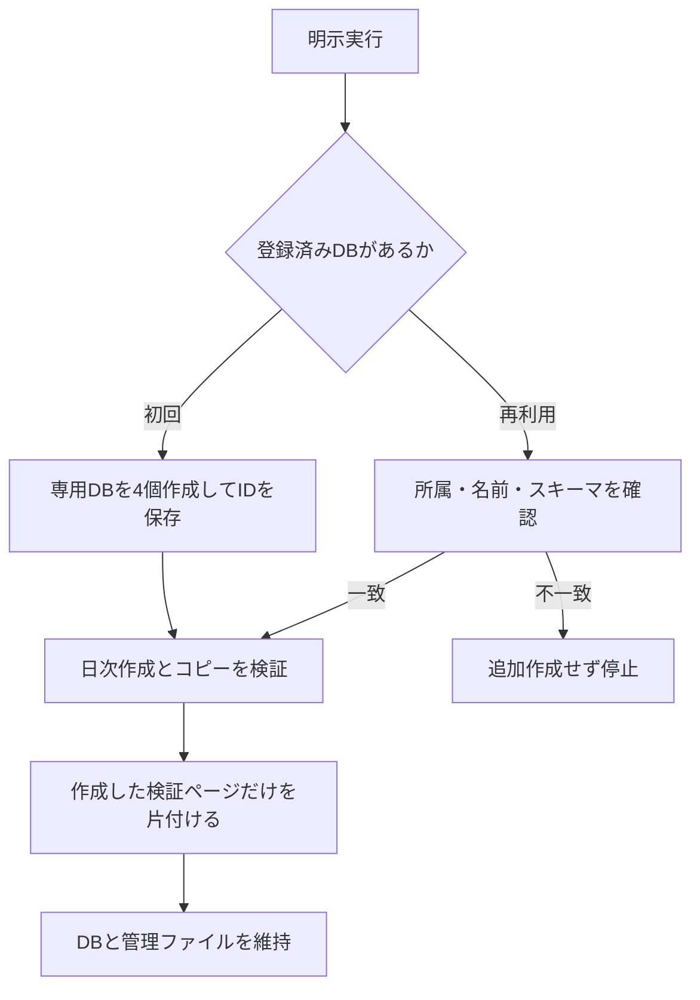

# 実API検証

この文書は、専用DBでの最終確認・DB再利用・実行上限・操作ログ・後片付けを説明します。実APIは必要なときだけ `--execute` で明示実行し、DBは再利用して検証ページだけを片付けます。

## 目次

- [実APIを使う場面](#実apiを使う場面)
- [事前準備](#事前準備)
- [実行方法と確認内容](#実行方法と確認内容)
- [DBの作成と再利用](#dbの作成と再利用)
- [実行上限](#実行上限)
- [操作ログと管理ファイル](#操作ログと管理ファイル)
- [失敗時の対応](#失敗時の対応)
- [公式情報](#公式情報)

## 実APIを使う場面

- 移行の最終仕上げ。
- モックでは判断できないサーバーの受理条件・権限・実レスポンスの確認。
- 通常の開発・修正は[モックと型チェック](testing.md)で確認します。
- 自動テスト・インストール・定期実行から実API検証を起動しません。
- 検証のスケジュール登録も行いません。

## 事前準備

### 専用接続と親ページ

1. 検証用の親ページを用意し、検証用接続に共有します。
2. 接続に読み取り・挿入・更新とユーザー一覧の権限を付与します。
3. [.env.test.example](../.env.test.example) を `.env.test.local` にコピーします。
4. 次の2つを設定します。本番のトークンやIDは流用しません。

| 環境変数 | 用途 |
|---|---|
| `NOTION_TEST_KEY` | 検証用接続トークン |
| `NOTION_TEST_PARENT_PAGE_ID` | 検証用の親ページID |

### 実行前の確認

- ワークスペースの利用量を確認します。
- 東京時間で日付が変わる時間帯を避けます。
- 検証DBは空である必要があります。他のページがあれば停止し、そのページは削除しません。
- モックの成功だけでは、実APIの受理と保存結果は保証できません。

## 実行方法と確認内容

### 予定表示と実行

```sh
# 通信・リソース操作なし
yarn test:integration
# 実APIへ接続する
yarn test:integration --execute
```

### 確認する結果

- 実際の `yarn all:create` で作った3ページの作成先・件数・タイトル・日付を再取得します。
- Diaryが日次作成に含まれないことを確認します。
- 階層コピー・TODOの未チェック化・statusの保存結果を再取得します。
- 認証・各CLIの照会・Diary複製はモックで確認し、実APIでは重複実行しません。

## DBの作成と再利用

### 全体の流れ



検証が途中失敗した場合も、記録済みページの後片付けを試みます。結果不明の要求や通信制限があれば停止し、[失敗時の対応](#失敗時の対応)に従います。

### 初回のDB作成

- Retro・Body・Sleep・Diaryの4つと必要なプロパティを作成します。
- `initial_data_source.properties` でスキーマを指定します。
- Diaryの `status: {}` は標準の選択肢を作成します。
- DB IDとデータソースIDを管理ファイルに保存し、検証プロセス内で設定します。

### 再利用の条件

- 親ページと初期作成ID入りの名前が一致する。
- ゴミ箱に入っていない。
- データソースが1件で、登録済みIDと一致する。
- 必要なプロパティ型が一致する。

次の場合は、置換DBを自動作成せず停止します。

- 取得不能、ゴミ箱入り、所属・名前・スキーマ・データソースの不一致。
- 管理ファイルの破損。
- 維持対象DBが履歴にあるのに `pool.json` がない。

### 後片付けの対象

- その実行で作成成功を記録したページIDだけを対象にします。
- 所属データソースを再確認して `in_trash: true` にします。完全削除ではありません。
- 名前の一致だけで既存ページを削除しません。
- DBと親ページは残します。再利用DBのゴミ箱移動は通信制御でも拒否します。
- 旧方式の実行状態を明示的に `--cleanup` した場合のみ、旧方式のDB後片付けを行います。

## 実行上限

### 固定する上限

| 対象 | 上限 |
|---|---|
| 検証DB | 管理ファイルにつき4個。初期作成後は再利用 |
| ページ | 1回5個 |
| 本文ブロック | 1回6個 |
| 通常のAPI要求 | 1回80件 |
| 後片付けのAPI要求 | 別枠30件 |
| 通信間隔 | 子プロセスを含め1秒 |
| 新規実行 | 24時間に1回、履歴で累計5回 |
| 同時実行 | 拒否 |

- 失敗した作成要求も枠を消費します。
- 未完了の実行があれば、新規実行を拒否します。
- 上限は [integration_safety.ts](../scripts/lib/integration_safety.ts) に固定しています。
- 後片付けを再開しても、元の件数と上限を引き継ぎます。

### ワークスペース全体の制限

- 制御は、このチェックアウトに保存した履歴に基づきます。
- 履歴を削除したり、別コピーから並列実行したりしません。
- 他の接続との共有通信枠や残容量は、この制御だけでは保証できません。
- 複数メンバーのFreeワークスペースでは、削除しても累計作成枠は戻りません。
- DBを再利用しても、作るページと本文は累計枠を消費します。

## 操作ログと管理ファイル

### 保存する情報

| ファイル | 内容 |
|---|---|
| `.notion-test-runs/<実行ID>.jsonl` | 日時・操作・HTTP結果・作成ID・CLIの成否と中断 |
| `.notion-test-runs/<実行ID>.json` | 件数・対象ID・後片付け状態・結果不明の要求 |
| `.notion-test-runs/pool.json` | DB ID・データソースID・親ページ・初期作成の実行ID |

### 保存方法

- 送信前と結果取得後にディスクへ同期します。ログを保存できなければ送信しません。
- トークン・認証ヘッダー・本文・プロパティ値・CLIの生出力は保存しません。
- Gitには含めず、ローカルに保持します。
- IDを含むため、ファイルは0600、ディレクトリは0700で作成します。
- 管理ファイルと実行履歴をまとめて保持・バックアップします。
- CLI子プロセスにも同じ監査と通信制御を適用します。
- CLIのタイムアウト時は、Yarnを含むプロセス群を停止してから片付けます（macOS/Linux）。

## 失敗時の対応

### APIエラーと結果不明

- 429/529では再送せず停止します。`Retry-After` 経過までは後片付けの通信も拒否します。
- 作成のタイムアウトや5xxは結果不明として記録し、再作成しません。
- 結果不明の要求・上限到達は自動解除しません。ログとNotion上の対象を確認します。
- ページの所属を確認できなければ、削除せず停止します。

### 後片付けの再開

```sh
# 予定確認。通信なし
yarn test:integration --cleanup <実行ID>
# 記録済み検証ページだけを片付ける
yarn test:integration --cleanup <実行ID> --execute
# 終了したプロセスのロックが残る場合だけ
yarn test:integration --cleanup <実行ID> --execute --recover-lock
```

`--recover-lock` は元のプロセスが生きていれば拒否します。

### 初期DB作成の中断

- 作成予定は送信前、IDは取得直後に保存します。
- 既知のDBは残し、IDを取得できなかった作成要求を自動で繰り返しません。
- 初回実行でIDの管理ファイル反映だけが中断した場合は、後片付け時に所属と名前を確認して復元します。
- 別の実行で初期作成を続けた際の中断は、[手動復旧手順](integration-recovery.md)に従います。
- 結果不明なら、ログと `Notion API Test <初期作成の実行ID>` のDBを照合します。
- 管理ファイルを削除して作り直す運用は行いません。

## 公式情報

- [DB作成API](https://developers.notion.com/reference/create-database)
- [データソースのプロパティ](https://developers.notion.com/reference/property-object)
- [リクエスト制限](https://developers.notion.com/reference/request-limits)
- [ワークスペースのブロック制限](https://developers.notion.com/reference/workspace-block-limits)
